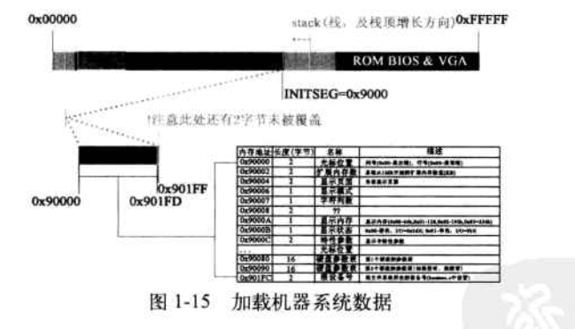
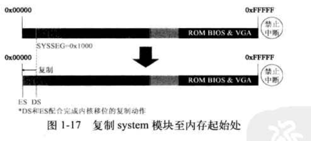

# 操作系统高级教程学习笔记

[toc]

## 第一章 从开机到执行main函数之前的过程

从开机到main函数的执行分三步完成：

1. 启动BIOS，准备**实模式**下的中断向量表和中断服务程序
2. 从启动盘加载操作系统程序到内存，加载操作系统程序的工作就是利用第一步中准备的中断服务程序实现的
3. 为执行32位的main函数做过渡工作

### 什么是实模式

**实模式**：指x86架构处理器的一种运行模式，它是最初IBM PC兼容机使用的8086和8088处理器的默认模式。在这种模式下，*处理器操作的是物理内存地址，而没有使用任何形式的内存管理，如分页或段保护*。

#### 主要特点

1. **内存访问限制**：由于地址线限制，实模式下CPU只能访问最多1MB的内存。
2. **无内存保护**：实模式不提供内存保护机制，*所有程序都可以访问全部的物理内存*，这可能导致系统不稳定。
3. **硬件直接访问**：程序可以直接访问硬件资源，如I/O端口、中断。

#### 主要用途

1. **启动过程**：*大多数x86架构的计算机在启动时首先进入实模式*。这是因为处理器在重置后默认进入实模式，操作系统的引导加载程序（Bootloader）首先在实模式下运行，然后将系统转换到更先进的保护模式以使用更多高级的功能。
2. **简单操作系统和应用程序**：早期的操作系统，如MS-DOS，运行在实模式下，因为它们是为8086/8088架构设计的，当时没有更高级的运行模式。
3. **兼容性**：一些基于BIOS的操作或旧软件可能需要在实模式下运行，以确保与老旧硬件的兼容性。

总结：相比较于比较高级的内存管理模式，操作系统一般开机时不需要这些管理，这个模式叫做实模式，直接对物理内存进行操作。

### 第一步：启动BIOS

在电脑启动时，RAM中什么程序也没有的时候，谁来完成加载软盘中操作系统的任务呢？**BIOS**

#### BIOS 的启动原理

*问题：在开机加电的一瞬间，内存中什么程序也没有，不可能有操作系统，无法人为地执行BIOS 程序，那BIOS程序又是由谁来执行的呢？*

***0xFFFF0***，由硬件完成，BIOS的第一条指令、BIOS程序入口地址就是0xFFFF0！

Intel 将所有80x86 系列的CPU (包括最新型号的 CPU)的硬件都设计为加电即进入16位实模式状态运行，将CPU 硬件逻辑设计为加电瞬间强行将CS的值置为OxFFFF, IP的值置为0x0000，这样CS:IP就指向 0xFFFF0这个地址位置，如下图：


IP/EIP：指令指针寄存器，保存要执行的指令在代码段内的偏移地址，和CS组合后成为要执行指令的内存地址。IP为16bit，EIP为32bit。

CS：代码段寄存器，指向当前执行代码在内存中所在的区域。

#### 加载中断向量表和中断服务程序

BIOS 程序被固化在计算机主板上的一块很小的 ROM 芯片里。

BIOS程序在内存最开始的位置(即 :0x00000)用**1KB**的内存空间(0x00000 ~ 0x003FF)构建中断向量表，并在紧挨着它的位置用**256B**构建BIOS数据区(0x00400 ~ 0x004FF)，在大约56KB以后的位置(0x0E2CE)加载了**8KB**左右的中断服务程序。


中断向量表中有**256**个中断向量，每个中断向量占**4B**，其中两个字节是CS的值，两 个字节是IP的值，每个中断向量都指向一个具体的中断服务程序。

### 第二步：加载操作系统内核程序并为保护模式做准备

对于 Linux0.11操作系统而言，计算机将分三批逐次加载操作系统的代码：

1. 由BIOS中断`int 0x19`把第一扇区bootsect内容加载到内存
2. 把后面4个扇区加载到内存
3. 把后面240个扇区加载到内存

#### 加载第一部分：bootsect

##### 引导程序（bootsect）

即Boot Sector，引导扇区。

引导扇区是存储在存储介质（如硬盘或软盘）上的一个特殊的扇区，它包含了启动计算机时必要的代码。对于硬盘来说，引导扇区通常位于磁盘的第一个扇区（即主引导记录，MBR）。其特点包括：

1. **大小限制**：引导扇区的大小通常限制为512字节。
2. **启动代码**：包含必要的代码来加载更复杂的引导加载器或操作系统。例如，在Linux系统中，MBR可能包含GRUB引导加载器的一部分。
3. **结束标记**：引导扇区以一个特定的字节序列（`0x55AA`）结束，这被BIOS用来确认这是一个有效的引导扇区。
4. **引导加载器**：在现代操作系统中，引导扇区通常只是引导过程的第一步。它会加载更大、功能更强的引导加载器（如GRUB或Windows Boot Manager），这些加载器进而加载操作系统的核心部分。

##### `int 0x19` 中断

`int 0x19` 是一个BIOS中断调用，在早期的PC兼容系统中用于引导过程。这个中断的功能是加载并执行bootsect的代码。其工作流程如下：

1. **BIOS初始化**：计算机开机后，BIOS首先进行自检（POST），然后搜索可启动设备。
2. **执行`int 0x19`中断**：BIOS通过执行`int 0x19`中断来跳转到中断服务程序，读取引导扇区的代码到内存并执行。这时，控制权从BIOS传递到引导扇区的代码。
3. **启动操作系统**：引导扇区的代码通常会加载操作系统的更多部分（如Linux的GRUB引导加载器）或直接引导一个简单的操作系统（如DOS）。

#### 加载第二部分：SETUP

##### 1.内存规划

为了把第二批和第三批程序加载到内存中的适当位置，bootsect 首先做的工作就是规划内存，代码如下：

```assembly
SETUPLEN = 4					! 要加载的SETUP程序扇区数
BOOTSEG  = 0x07c0			! 启动扇区被BIOS加载的位置
INITSEG  = 0x9000			! 要移动到的新位置
SETUPSEG = 0x9020			! 被加载到的位置
SYSSEG   = 0x1000			! 内核被加载的位置
ENDSEG   = SYSSEG + SYSSIZE		! 内核的末尾位置
ROOT_DEV = 0x306			! 根文件系统设备号
```

为了确保载入内存的代码和已经载入的部分互不冲突而且各自有足够的空间。

##### 2.复制bootsect

```assembly
mov	ax,#BOOTSEG
mov	ds,ax
mov	ax,#INITSEG
mov	es,ax
mov	cx,#256
sub	si,si
sub	di,di
rep
movw
```

1. `mov ax, #BOOTSEG`
   - 这行代码将`BOOTSEG`（一个预定义的常量，通常是0x07C0）的值移动到寄存器`ax`中。`BOOTSEG`是引导扇区被加载到内存中的段地址。
2. `mov ds, ax`
   - 这行代码将`ax`寄存器的值（即`BOOTSEG`）设置为数据段寄存器`ds`的值。这是为了使后续的数据访问可以从引导扇区的内存位置开始。
3. `mov ax, #INITSEG`
   - 这行代码将`INITSEG`的值移动到`ax`寄存器。`INITSEG`是一个预定义的常量，表示数据应该被复制到的目标内存段的地址。
4. `mov es, ax`
   - 这行代码设置附加段寄存器`es`的值为`ax`寄存器的值（即`INITSEG`）。`es`寄存器通常用于字符串操作和一些特殊的内存操作。
5. `mov cx, #256`
   - 这行代码将数字256移动到`cx`寄存器，它在接下来的`rep movsw`操作中作为计数器使用。由于每次`movsw`移动2个字节，所以这实际上指示复制512字节（256 * 2），即整个引导扇区。
6. `sub si, si`
   - 这行代码将源索引寄存器`si`置零。`si`在内存操作中用作源地址偏移。
7. `sub di, di`
   - 这行代码将目的索引寄存器`di`置零。`di`在内存操作中用作目的地址偏移。
8. `rep movw`
   - `rep`是一个前缀，表示重复后面的指令直到`cx`寄存器的值减到0。
   - `movw`是一条指令，意味着从源地址（由`ds:si`指定）复制一个字（word，即两个字节）到目的地址（由`es:di`指定），同时`si`和`di`会根据方向标志相应地递增或递减。

总结来说，这段代码的功能是将引导扇区的内容（512字节）从其初始加载位置（`BOOTSEG`）复制到另一个内存位置（`INITSEG`）。运行后CPU的CS指向0x07C0（BOOTSEG）。

之后，bootsect执行下面代码：

```assembly
jmpi	go,INITSEG
go:	mov	ax,cs
	mov	ds,ax
```

`jmpi go, INITSEG`

- `jmpi` 是一个跳转指令，用于在内存中的特定地址处继续执行代码。这个指令的格式是 `jmpi [目标地址], [段地址]`。
- 在这个案例中，`go` 是跳转的目标地址（一个标签），而`INITSEG`是目标段地址。这个指令使程序跳转到`INITSEG`段的`go`标签所在的位置继续执行。
- 这通常用于将程序的控制权转移到新的内存位置，特别是在引导过程中，当代码从一个内存区域复制到另一个后，需要跳转到新位置继续执行。

`go: mov ax,cs`

- `go:` 是一个标签，代表下一条指令的开始位置。
- `mov ax,cs` 这条指令将代码段寄存器 `cs` 的值移动到 `ax` 寄存器。在这种情况下，它用于获取当前代码段的地址。

`mov ds,ax`

- 这行指令将 `ax` 寄存器（现在包含代码段地址）的值移动到数据段寄存器 `ds`。这样做的目的是同步代码段和数据段的地址，确保数据段寄存器指向正确的数据段。

通过这三行代码，实现了内存位置跳转。并接着执行新位置的下一条指令，避免死循环。

*从现在起，操作系统已经不需要完全依赖BIOS，可以按照自己的意志把自己的代码安排在内存中的某个位置了。*


```assembly
go:	mov	ax,cs
	mov	ds,ax
	mov	es,ax
! put stack at 0x9ff00.
	mov	ss,ax
	mov	sp,#0xFF00		! arbitrary value >>512
```

通过ax，把数据段寄存器DS、附加段寄存器ES、段基址寄存器SS设置为代码段寄存器CS的值，并将栈顶指针SP设置为偏移地址0xFF00（实际为0x9FF00），栈由高地址向低地址增长。在这次后，栈就可以使用了。


##### 3.加载SETUP程序

`int 0x13`中断：磁盘服务程序

- `ah` 寄存器通常用于指定要执行的操作（功能号）。
- `al` 寄存器用于指定要操作的扇区数。
- `ch`、`cl`、`dh`、`dl` 寄存器用于指定磁盘号和扇区地址（磁道号、扇区号、磁头号）。
- `es:bx` 指向数据缓冲区，用于读取或写入数据。

```assembly
load_setup:
	mov	dx,#0x0000		! drive 0, head 0
	mov	cx,#0x0002		! sector 2, track 0
	mov	bx,#0x0200		! address = 512, in INITSEG
	mov	ax,#0x0200+SETUPLEN	! service 2, nr of sectors
	int	0x13			! read it
	jnc	ok_load_setup		! ok - continue
	mov	dx,#0x0000
	mov	ax,#0x0000		! reset the diskette
	int	0x13
	j	load_setup

ok_load_setup:
```

SETUP程序被复制到0x90200，bootsect尾端。


此时SS:SP指向0x9FF00，这与setup程序的起始位置0x90200还有很大的距离，即便加载进来后，系统仍然有足够的内存空间用来执行数据压栈操作。

#### 加载第三部分：SYSTEM模块

用同样的`int 0x13`中断加载SYSTEM模块。这与之前并无本质区别。

比较突出的是这次加载的扇区数是240，是之前4个扇区的60倍，且所需时间也是之前的几十倍。

**为了防止加载期间用户误认为是机器故障，而执行不适当的操作，Linus在此设计了显示一行屏幕信 息“Loading system”以提示用户计算机此时正在加载系统。**

此时操作系统的main函数还没有开始执行，在屏幕上显示一行字符串远没有用C语言写一句printf (“Loading system”)调用那么容易，所有工作都要靠一行一行的汇编代码来实现，从体系结构的角度看，显示器也是一个外设，所以还要用到其他的BIOS中断。

这里代码不再详细说明。

之后完成后需要再次确认根设备号。


##### 为什么要确认根设备号？

1. **定位根文件系统**：操作系统需要知道哪个设备包含了根文件系统，这样它才能正确地挂载这个文件系统并继续启动过程。
2. **设备独立性**：不同的计算机可能会有不同的硬件配置。根设备号的确认使操作系统能够在各种硬件上灵活工作，而不是硬编码为特定的设备。
3. **启动不同的操作系统**：在多启动环境中，可能有多个操作系统或多个Linux内核版本。每个系统或版本可能有不同的根设备。

**怎么做？**

在Linux的启动过程中，根设备号的确认通常涉及以下步骤：

1. **引导加载器传递**：现代的引导加载器（如GRUB）在加载内核时可以通过引导参数指定根设备。例如，引导参数可能包含像 `root=/dev/sda1` 这样的项，其中 `/dev/sda1` 指定了根文件系统所在的设备。
2. **内核处理**：内核在启动时会解析这些引导参数，并据此确定根设备。内核会查找这个设备，并尝试将其作为根文件系统挂载。
3. **动态检测**：如果引导加载器没有指定根设备，或者指定的设备不可用，内核可能会尝试动态检测根设备。这可能包括搜索连接的硬盘驱动器，并尝试识别文件系统。
4. **初始RAM磁盘（initrd）**：在某些情况下，尤其是在复杂的硬件配置中，内核可能首先加载一个初始RAM磁盘（initrd）。这是一个临时的根文件系统，加载在内存中。initrd 包含了必要的驱动程序和工具，以帮助内核找到并挂载真正的根文件系统。

现在，bootsect程序任务都完成了！

下面就要跳转到0x90200的SETUP程序执行。

```assembly
jmpi 0, SETUPSEG
```

程序现在开始执行。它做的第一件事请就是利用BIOS提供的中断服务程序从设备上**提取**内核运行所需的机器系统数据，其中包括光标位置和显示页面等数据，并分别从中断向量0x41和0x46向量值所指的内存地址处获取硬盘参数表1和硬盘参数表2，把它们存放在0x9000:0x0080和0x9000:0x0090处。

```assembly
 ok, the read went well so we get current cursor position and save it for
! posterity.

	mov	ax,#INITSEG	! this is done in bootsect already, but...
	mov	ds,ax
	mov	ah,#0x03	! read cursor pos
	xor	bh,bh
	int	0x10		! save it in known place, con_init fetches
	mov	[0],dx		! it from 0x90000.

! Get memory size (extended mem, kB)

	mov	ah,#0x88
	int	0x15
	mov	[2],ax
	
... ! 这里省略大概70行
...

	mov	cx,#0x10
	mov	ax,#0x00
	rep
	stosb
```

##### 获取系统信息

使用`int 0x10`中断获取光标位置，使用`int 0x15`获取系统内存大小等，并将这些信息保存到数据段。

##### 初始化内存区域

1. `mov cx, #0x10`
   - 设置`cx`寄存器为0x10，这是重复操作的计数。
2. `mov ax, #0x00`
   - 将`ax`寄存器清零，准备用于`stosb`指令。
3. `rep stosb`
   - 这是一个重复字符串操作指令。`stosb`将`al`寄存器的值存储到`es:di`指向的内存位置，然后`di`会根据方向标志递增或递减。这里`rep`前缀使得`stosb`操作重复进行，直到`cx`寄存器的计数减到0。本质上，这段代码在初始化一段内存区域，将其清零。



BIOS提取的机器系统数据将覆盖bootsect 程序所在的部分区域。由于这些数据是要留用的，因此在它们失去使用价值之前，一定不能被覆盖掉。

注意这里内存使用非常严谨，bootsect占用的512B加载了一个510B的系统数据，最大化利用内存。

### 第三步：为32为main函数调用做准备

#### 关中断，移动SYSTEM位置到0x00000

关闭中断，即将CPU的标志寄存器(EFLAGS)中的中断允许标志(IF)置0。系统不再响应中断请求。*直到后续main函数能够适应保护模式的中断服务体系被重建成功才会打开中断，在那时候响应中断的服务程序将由操作系统提供。*

```assembly
cli // 关中断
```

开中断指令：`sti`

下面，setup程序做 了一个影响深远的动作：将位于0x10000的内核程序拷贝至内存地址起始位置0x00000处：

```assembly
do_move:
	mov	es,ax		! destination segment
	add	ax,#0x1000
	cmp	ax,#0x9000
	jz	end_move
	mov	ds,ax		! source segment
	sub	di,di
	sub	si,si
	mov 	cx,#0x8000
	rep
	movsw
	jmp	do_move
```

循环开始：`do_move`

- `do_move` 是一个标签，表示这段代码的开始，用于循环跳转。

设置目的段地址：`mov es, ax`

- 这行代码将寄存器 `ax` 的值设置到附加段寄存器 `es`。在这里，`es` 用于指定数据移动的目的段地址。

更新源段地址：`add ax, #0x1000`

- `add ax, #0x1000` 将 `ax` 寄存器的值增加 0x1000。这是为了准备下一次迭代，将源段地址设置为当前地址加上 0x1000。

检查结束条件：`cmp ax, #0x9000`

- `cmp ax, #0x9000` 比较 `ax` 寄存器的值和 0x9000。这是一个检查是否到达了某个特定的内存地址，作为循环结束的条件。

结束循环：`jz end_move`

- 如果 `ax` 等于 0x9000，即 `cmp` 指令的结果为零，则跳转到 `end_move`，这标志着数据移动过程的结束。

设置源段地址：`mov ds, ax`

- 将 `ax` 寄存器的值（现在为增加了0x1000的值）设置为数据段寄存器 `ds`。`ds` 用于指定数据移动的源段地址。

初始化索引寄存器：`sub di, di` 和 `sub si, si`

- 这两行代码将目的索引寄存器 `di` 和源索引寄存器 `si` 清零。这是为了在内存复制过程中从段的开始处（偏移量为0）开始复制。

设置计数器：`mov cx, #0x8000`

- 将0x8000（即32768）移动到计数器寄存器 `cx`。这表示要复制的字（word，每个2字节）的数量。

执行字符串复制：`rep movsw`

- `rep movsw` 指令重复执行 `movsw`（move string word），即从 `ds:si` 指向的位置开始复制字符串到 `es:di` 指向的位置。每次复制都会移动一个字，同时 `si` 和 `di` 寄存器分别递增2个单位，直到 `cx` 寄存器减到0。

循环跳转：`jmp do_move`

- 无条件跳转回 `do_move`，重新开始循环。



这个复制动作将BIOS中断向量表和BIOS数据区完全覆盖，因此不再有处理中断的能力了。所以这就是我们关中断原因。

##### 为什么这么做？“破旧立新”

1. 废除BIOS的中断向量表，等价于废除了BIOS 提供的实模式下的中断服务程序。
2. 收回使用寿命刚刚结束的程序所占的内存空间。
3. 让内核代码占据内存物理地址最开始的、最天然的、最有利的位置。

#### 设置中断描述符表和全局描述符表

##### GDT（Global Descriptor Table）

- **GDT** 是全局描述符表的缩写，是系统中唯一存放段寄存器内容的数组，在保护模式下，它是用于定义不同段（segment）的特性的一个数据结构。每个段可以是代码段、数据段或系统段，如任务状态段（TSS）等。可理解为**所有进程的总目录表**，存放着每个任务的局部描述符表LDT和任务状态段TSS地址，用于完成进程中各段的寻址、现场保护和现场恢复。
- **段描述符**：GDT 中的每个条目都是一个段描述符，包括了段的基址、限长、访问权限等信息。

##### GDTR（Global Descriptor Table Register）

- **GDTR** 是用于存储GDT的起始地址和大小的寄存器。操作系统在进入保护模式时设置GDTR，以便CPU知道从哪里找到GDT。
- **初始化**：操作系统在启动时会初始化GDTR，指向GDT的位置。

##### IDT（Interrupt Descriptor Table）

- **IDT** 是中断描述符表的缩写。它用于定义处理中断和异常的处理程序（中断服务例程）的地址和属性。
- **中断向量**：IDT中的每个条目对应于一个中断向量，它包含了中断处理程序的段选择子和偏移量。

##### IDTR（Interrupt Descriptor Table Register）

- **IDTR** 用于存储IDT的起始地址和限长。CPU通过IDTR知道从哪里获取IDT的信息。
- **初始化**：操作系统负责初始化IDTR，以便在中断发生时，CPU能够正确地定位到相应的中断处理程序。

```assembly
gdt:
	.word	0,0,0,0		! dummy

	.word	0x07FF		! 8Mb - limit=2047 (2048*4096=8Mb)
	.word	0x0000		! base address=0
	.word	0x9A00		! code read/exec
	.word	0x00C0		! granularity=4096, 386

	.word	0x07FF		! 8Mb - limit=2047 (2048*4096=8Mb)
	.word	0x0000		! base address=0
	.word	0x9200		! data read/write
	.word	0x00C0		! granularity=4096, 386

idt_48:
	.word	0			! idt limit=0
	.word	0,0			! idt base=0L

gdt_48:
	.word	0x800		! gdt limit=2048, 256 GDT entries
	.word	512+gdt,0x9	! gdt base = 0X9xxxx
```

**GDT定义**

1. **空描述符**
   - `.word 0,0,0,0`
   - 这是GDT的第一个条目，称为“空描述符”。在GDT中，第一个描述符必须是空的，它不被用来描述任何段。
2. **代码段描述符**
   - `.word 0x07FF, 0x0000, 0x9A00, 0x00C0`
   - 这定义了一个代码段描述符。其各部分意义如下：
     - `0x07FF`：段限长，这里设置为2047。由于使用了**粒度**位，实际大小为2048 * 4096 = 8MB。
     - `0x0000`：段基址，这里设置为0。
     - `0x9A00`：段属性，其中包含读取/执行权限，表示这是一个代码段。
     - `0x00C0`：粒度和操作大小标志。0xC0意味着**粒度**是4096字节（4KB），并且是32位的保护模式。
3. **数据段描述符**
   - `.word 0x07FF, 0x0000, 0x9200, 0x00C0`
   - 这定义了一个数据段描述符。其结构与代码段类似，但段属性是`0x9200`，表示这是一个可读写的数据段。

**IDT指针（idt_48）**

- `.word 0, 0, 0`
- 这定义了IDT的指针结构。这里设置的是一个空的IDT，其界限为0，基址也为0。在实际系统中，这通常会被重新配置以指向实际的IDT。

**GDT指针（gdt_48）**

- `.word 0x800, 512+gdt, 0x9`
- 这是GDT的指针结构，指向上面定义的GDT。
  - `0x800`：GDT的界限，这里设置为2048，意味着最多可以有256个GDT条目（每个条目8字节）。
  - `512+gdt`：GDT的基址。这里`gdt`是GDT开始的地方，`512`可能是为了对齐或其他目的的偏移量。
  - `0x9`：段选择器的高位字节，通常是0。


##### 32位和16位中断机制

**16位中断机制**

- **使用中断向量表**：在16位的中断机制（如在x86的实模式下）中，系统使用**中断向量表（IVT）**来处理中断。这个表包含了中断处理程序的地址。
- **固定的起始位置**：中断向量表的起始位置固定在内存的0x00000地址处。每个中断向量占用4字节（一个段地址和一个偏移量），指向相应的中断处理程序。
- **有限的中断向量**：由于IVT的大小和位置是固定的，它只能包含有限的中断向量（通常是256个，对应256种不同的中断）。

**32位中断机制**

- **使用中断描述符表IDT**：在32位处理器的保护模式下，系统使用**中断描述符表（IDT）**来管理中断。IDT是一个更先进和灵活的数据结构，用于定义中断处理程序的入口。
- **灵活的位置**：IDT的位置不是固定的，而是可以由操作系统设计者根据需要灵活安排。这提供了更大的灵活性和控制能力。
- **IDTR寄存器**：IDT的位置由IDTR（中断描述符表寄存器）指定。操作系统在启动时设置IDTR，告诉处理器IDT的确切位置和大小。
- **增强的安全性和功能**：由于IDT的灵活性和保护模式下的内存管理特性，32位的中断机制提供了更高的安全性和更丰富的功能，例如中断门、陷阱门等。

**总结**

总的来说，与16位的基于IVT的中断机制相比，32位处理器中使用的基于IDT的中断机制提供了更高的灵活性、更强的功能和更好的安全性。这些改进是由于保护模式下更先进的内存管理和中断处理能力所带来的。在现代计算机系统中，这些特性对于支持复杂的操作系统和应用程序至关重要。

#### 打开A20，实现32位寻址

```assembly
! that was painless, now we enable A20

	call	empty_8042
	mov	al,#0xD1		! command write
	out	#0x64,al
	call	empty_8042
	mov	al,#0xDF		! A20 on
	out	#0x60,al
	call	empty_8042
```

打开A20意味着CPU可以进行32位寻址 ，最大寻址空间为4GB。

1. `call empty_8042`
   - 这个调用是为了确保键盘控制器的输入/输出缓冲区为空。`empty_8042`函数通常会检查键盘控制器的状态，等待直到可以安全地发送命令或数据。
2. `mov al, #0xD1`
   - 将0xD1移入`al`寄存器。这是向键盘控制器发送的命令，表示接下来要发送的是一个控制器命令。
3. `out #0x64, al`
   - 将`al`寄存器的内容（命令0xD1）输出到端口0x64，即键盘控制器的命令端口。
4. 再次调用`empty_8042`以确保键盘控制器准备好接收下一个命令。
5. `mov al, #0xDF`
   - 将0xDF移入`al`寄存器。这是用于启用A20线的实际命令。
6. `out #0x60, al`
   - 将命令0xDF输出到端口0x60，这是键盘控制器的数据端口。这个操作实际上修改了键盘控制器的内部设置，以启用A20线。
7. 最后，再次调用`empty_8042`以确保命令被正确处理。

##### 为什么涉及到了键盘？

打开A20线涉及到键盘控制器的原因源于历史上的设计决策和硬件架构的限制。在早期的PC架构中，特别是在IBM PC和其兼容机上，键盘控制器（通常是Intel 8042芯片）不仅负责键盘输入的处理，还承担了系统级别的一些控制职能，包括A20线的控制。

**A20线的历史背景**

- 在8086和8088处理器中，由于地址线的限制，CPU只能寻址1MB的内存。地址线A20（第21位地址线）被用于这种寻址方式。
- 当引入了可以寻址更多内存的80286处理器时，为了保持向后兼容性，需要一种方法来模拟8086的寻址行为，即在内存达到1MB时**回滚**。
- A20线就是这种机制的一部分。在初始状态下，A20线被禁用，使得内存寻址在达到1MB时环绕回0。

**键盘控制器的作用**

- 在IBM PC的设计中，键盘控制器（8042芯片）不只是处理键盘输入，它还与系统的其他部分密切相关，包括控制A20线的状态。
- 这是因为8086和8088处理器的设计中没有直接控制A20线的机制。因此，IBM在设计PC时选择了键盘控制器作为实现这一功能的方式。

**打开A20线的过程**

- 为了进入32位保护模式并使用超过1MB的内存，需要启用A20线。
- 由于在硬件上A20线的控制与键盘控制器相关联，因此操作系统或引导加载程序必须通过发送特定的指令给键盘控制器来改变A20线的状态。
- 这个过程涉及向键盘控制器发送一系列命令，以确保A20线被激活，从而允许CPU访问整个32位地址空间。

**总结**

综上所述，键盘控制器在打开A20线的过程中的作用是由于早期PC硬件设计的遗留问题。虽然这种设计在现代看来可能有些奇怪，但它是早期PC兼容机架构中的一个重要特性，确保了向后兼容性的同时，也支持了新技术的引入。随着技术的进步，现代计算机已经不再需要这种机制来控制A20线了。

##### 回滚机制

寻址超过范围后循环。

#### 为在保护模式执行head.s做准备

为了建立保护模式下的中断机制，SETUP程序将对可编程中断控制器8259A进行重新编程。

##### 8259A中断控制器

